# Claude SDK Website Generator

The Oracle / reference-website generation pipeline lives in `Generator/`.
It takes a high-level user prompt and produces approved multi-page reference
websites plus the canonical screenshot manifest + frozen PNG set that Harbor
packaging later copies (never regenerates) into a graded coding-agent
challenge.

## TL;DR

Every LLM call goes through the [Claude Agent SDK](https://pypi.org/project/claude-agent-sdk/)
via `claude_agent_sdk.query()`. There are no direct `anthropic.messages.create(...)`
calls. Structured stages use the SDK's native
`output_format={"type":"json_schema",...}` for typed payloads. The builder
stage uses the SDK's coding-agent toolkit. The verifier stage gets actual
rendered screenshots attached as image content blocks.

Defaults:

- Model: `sonnet` unless overridden (we use `claude-opus-4-7` for real runs)
- Builder `max_turns`: **100** (was 40 — bumped after observing turn-budget exhaustion on multi-issue repairs)
- Concept batch size: 2 candidates per round (was 5–6 — schema too heavy for one structured call)
- Manifest stored at `<site_dir>/screenshot-manifest.json`; PNGs at `<site_dir>/screenshots/reference/*.png`
- Both are **canonical artifacts** the Harbor packager will copy verbatim later

## Flowchart

```mermaid
flowchart TD
    A[GenerationRequest<br/>count, prompt, model, retries]:::input --> B
    B[LLM: orchestrator<br/>out: DatasetPlan + N SiteSeed]:::llm --> C{for each<br/>SiteSeed<br/>in parallel}
    C --> D[LLM: concept<br/>out: ConceptBatch &#40;2 candidates&#41;]:::llm
    D --> E[LLM: concept_critic<br/>out: ConceptCritique]:::llm
    E -->|regenerate=true| D
    E -->|best_candidate_id chosen| F[Coding agent: website_builder<br/>tools: Write Edit MultiEdit Read LS Glob Grep Bash<br/>cwd: site_dir, permission_mode=default + can_use_tool path guard<br/>max_turns=100<br/>out: files on disk + BuildReport]:::agent
    F --> G[HOST: _validate_written_files<br/>- index.html present<br/>- no abs / traversal / bad suffix<br/>raises PipelineError on violation]:::host
    G --> H[HOST: deterministic_verify &#40;async to_thread&#41;<br/>data extractor — NEVER a gate<br/>per declared page:<br/>- Playwright full-page screenshot &#40;tmp&#41;<br/>- render_sanity_score<br/>- accessibility_control_tags<br/>- webcoderbench_visual_quality_scores<br/>out: DeterministicCheckReport]:::host
    H --> M[LLM: manifest<br/>generate_oracle_manifest&#40;site_dir, concept&#41;<br/>via website_design_eval.manifest_generator<br/>writes site/screenshot-manifest.json]:::llm
    M --> N[HOST: capture-screenshots.mjs<br/>Node Playwright replay<br/>writes site/screenshots/reference/&lowast;.png]:::host
    N --> V[LLM: verifier<br/>image_paths = one PNG per declared page<br/>VERIFIER_SYSTEM tells it: judge, not gate<br/>out: VerifierReport status approved or needs_repair]:::llm
    V -->|needs_repair| F
    V -->|approved + attempt&gt;1| MR[LLM: manifest revalidate<br/>generate_oracle_manifest reads existing manifest<br/>as existing_manifest_prior and edits<br/>against the final DOM]:::llm
    MR --> NR[HOST: capture-screenshots.mjs replay<br/>refresh frozen PNGs against final DOM]:::host
    V -->|approved + attempt=1| AS
    NR --> AS[HOST: _assert_manifest_screenshots_complete<br/>every enabled capture must have a PNG on disk<br/>raises PipelineError otherwise]:::host
    AS --> Z[AcceptedWebsitePackage<br/>+ GenerationResult]:::output
    C -.parallel per seed.-> Z

    classDef llm fill:#dceeff,stroke:#3b82f6,color:#111
    classDef agent fill:#fde7c2,stroke:#d97706,color:#111
    classDef host fill:#dcfce7,stroke:#16a34a,color:#111
    classDef input fill:#f5f5f5,stroke:#737373,color:#111
    classDef output fill:#fbe8e8,stroke:#b91c1c,color:#111
```



Linear text version:

```text
GenerationRequest (CLI)
        │
        ▼  orchestrator → DatasetPlan
        │
        │  for each seed, IN PARALLEL (asyncio.gather with semaphore):
        │     concept → ConceptBatch (up to 2 candidates)
        │     concept_critic → ConceptCritique
        │        retry concept up to max_concept_rounds if rejected
        │
        │     for attempt in 1 .. max_builder_repair_rounds+1:
        │        builder (coding agent, max_turns=100) → BuildReport + files
        │        _validate_written_files (path hygiene; raises on bad paths)
        │        deterministic_verify in thread → DeterministicCheckReport
        │            (data only, never gates)
        │        if first attempt OR manifest is None:
        │            manifest agent → screenshot-manifest.json
        │        replay manifest → screenshots/reference/*.png
        │        verifier with one image per declared page → VerifierReport
        │
        │        if approved:
        │           if attempt > 1:
        │              regenerate manifest (edit-mode via existing_manifest_prior)
        │              re-replay against final DOM
        │           assert every enabled capture has its PNG on disk
        │           write AcceptedWebsitePackage
        │           break
        │        else:
        │           collect repair_instructions, continue loop
        │
        ▼
   GenerationResult (per seed + run-level totals)
```

## The four agents

| Agent | Method | Output schema | Tools | Notes |
|---|---|---|---|---|
| orchestrator | `run_json` | `DatasetPlan` | none | Plans N seeds from one prompt |
| concept | `run_json` | `ConceptBatch` (1–4 candidates) | none | Per-seed expansion; only 2 candidates per call to keep payload manageable |
| concept_critic | `run_json` | `ConceptCritique` | none | Scores + accepts/regenerates |
| **website_builder** | `build_site` | files on disk + `BuildReport` (host-built) | Write, Edit, MultiEdit, Read, LS, Glob, Grep, Bash | `permission_mode="default"` + `can_use_tool` path guard. `cwd=site_dir`. |
| verifier | `run_json` + image_paths | `VerifierReport` | none | Receives one PNG per declared page as user-message image content. **Sole judge** of approval. |
| manifest | `run_json` (under `generate_oracle_manifest`) | `ScreenshotManifest` | implementation-defined | Wraps `website_design_eval.manifest_generator.generate_manifest` |

### Builder safety layers

The builder runs as a real coding agent. Two layers of protection against
hallucinated paths:

1. **System prompt** explicitly forbids absolute paths and `..` traversal,
   with concrete CORRECT vs FORBIDDEN examples.
2. **`can_use_tool` callback** (`_make_cwd_path_guard`) intercepts every
   `Write` / `Edit` / `MultiEdit` and resolves `file_path` against the
   agent's `cwd`:
   - If the resolved path is inside cwd → allow (and rewrite to relative
     form if the agent passed an absolute path that happened to be inside).
   - If outside cwd → deny with a corrective message; agent gets a tool error
     and self-corrects.

The guard fails-closed: if the installed SDK version doesn't support
`can_use_tool`, `build_site` raises `AgentRuntimeError` rather than running
unguarded.

### Verifier sees real screenshots

Unlike the orchestrator/concept/critic stages, the verifier gets actual
rendered PNGs attached as image content blocks. This happens via
`run_json(..., image_paths=[...])`:

- `_prompt_as_stream_with_images` constructs an AsyncIterable user message
  with one text block + N base64-encoded image blocks
- `_select_verifier_screenshots` picks one PNG per declared page (the
  highest-weight capture for each page), no upper cap
- Hover/focus/scroll-detail captures are NOT sent to the verifier — those are
  for the eventual Harbor grader

The verifier prompt explicitly says screenshots are the primary evidence;
the deterministic metrics and concept text are supporting context only.

## The judge / extractor split

A core design principle: **the LLM verifier is the sole judge of approval.
The deterministic verifier is purely an extractor — it never gates.**

### `deterministic_verify` (in `verification.py`)

- Lists files, validates `index.html` exists
- Resolves each declared concept page path against the on-disk file
  (handles `/` → `index.html`, `/courses` → `courses.html` or `courses/index.html`)
- Per declared page, takes a Playwright screenshot into a tmp dir
- Runs metric extractors: `render_sanity_score`, `accessibility_control_tags`,
  `webcoderbench_visual_quality_scores`
- Returns a `DeterministicCheckReport` with the raw measurements
- `passed` is True **except** for hard physical impossibilities (no site dir,
  no files, no index.html) — and those are already gated upstream by
  `_validate_written_files`
- **Does not** emit severity labels, repair briefs, or scoring opinions

**`mobile_overflow_tags` is currently commented out.** It was producing
noisy "fix mobile overflow" issues on every site, crowding out real signal.
Mobile responsiveness should be judged from a true mobile screenshot at the
manifest stage instead.

### LLM verifier (`prompts.VERIFIER_SYSTEM`)

The verifier gets:

- The seed + concept (declared pages, motif, required_text, intent)
- The site's file list (just filenames)
- The full `DeterministicCheckReport` (numbers, tags, page presence map)
- **One screenshot per declared page** as image content

It outputs `VerifierReport` with:

- `status`: `approved` | `needs_repair` | `rejected`
- `scores`: 6 dimensional sub-scores (accessibility, mobile_responsiveness,
  component_consistency, layout_alignment, render_quality, page_completeness)
  plus `overall`
- `issues`: list of `RepairIssue` with severity `info` / `warning` / `error`
- `repair_instructions`: plain-English actionable text for a coding agent

The prompt explicitly tells the model:

- Treat measurements as signals, not gates
- Handle route templates (`/subjects/{slug}` satisfied by `subjects/biology.html`)
- Allow rephrased required_text if the intent matches
- **Never copy machine-format error strings verbatim** — translate them

## The accepted-package invariant

```
accepted-package.json must only be written after the final accepted DOM
has a replayed manifest and frozen screenshots under
site/screenshots/reference/*.png
```

Enforced in two places:

1. **`pipeline._assert_manifest_screenshots_complete`** runs right before
   `AcceptedWebsitePackage` construction. Every `enabled` capture in the
   manifest must have a matching PNG on disk; otherwise the seed raises
   `PipelineError` and is reported failed.
2. **`scripts/package_harbor_task.py`** runs the same check at packaging
   time. Harbor packaging is a **copy/freeze step, not a screenshot
   generation step.** It never invokes Playwright. If the source seed is
   missing PNGs, packaging fails loudly.

### Manifest revalidation on repair

When the verifier approves a build that came through ≥1 repair attempt, the
first-attempt manifest's selectors may no longer match the post-repair DOM.
We regenerate before packaging:

```python
if attempt_no > 1:
    manifest = await self._produce_manifest(...)   # edit-mode
    manifest_path = write_manifest(site_dir, manifest)
    replay(manifest_path)                          # refresh PNGs
```

The manifest generator's `_existing_manifest_prior` helper auto-loads the
first-attempt manifest as `existing_manifest_prior` in the LLM's context.
The system prompt instructs the model to **preserve the original capture
intent and IDs and only swap out selectors the post-repair DOM proves are
broken**. This makes it an edit, not a fresh regeneration.

If no repair fired (approval on attempt 1), the in-flight manifest was
already against the final DOM — we ship it as-is.

## Parallelism

The orchestrator runs serially (one DatasetPlan per request). Per-seed work
runs in parallel via `asyncio.gather` bounded by `GenerationRequest.max_parallel_sites`
(default 4). Within each seed, the pipeline is sequential.

Each seed's claude subprocess runs in its own SDK session — no shared state,
no cross-contamination of cwd/permissions.

## Observability

Every LLM call logs start + end with: agent name, stage, model, max_turns,
output_model, subtype, num_turns, duration_ms, total_cost_usd, tool_uses,
files_written (for builder), and a running cost total.

Per-call streaming is exposed:

- `ToolUseBlock`s log as `agent=X tool_use turn=N name=Y input={...}`
- `ThinkingBlock`s log as `agent=X thinking=...` (truncated)
- 30-second heartbeats during long calls log elapsed time + on-disk file
  count for the builder

Failures surface immediately:

- Per-seed errors in `_run_seed` log via `logger.exception` the moment they
  raise (not deferred until `asyncio.gather` resolves)
- Builder failures include `result_summary` with the SDK subtype
  (e.g. `error_max_turns`) so the cause is obvious
- Stage-level `_stage(seed, stage)` context manager logs START → DONE
  (or FAILED with elapsed time) so partial progress is visible

## Failure modes seen in real runs

| Failure | Mitigation now in place |
|---|---|
| Builder hallucinates absolute file_path | `can_use_tool` path guard rewrites or denies |
| Builder makes templated route paths like `/subjects/{slug}` | LLM verifier interprets intent; route templates are not literal-string checked |
| Repair builder exhausts turn budget | Bumped `build_site_min_turns` from 40 → 100 |
| Deterministic verifier produced machine-format repair briefs the builder couldn't act on | Refactor: deterministic is now data only; LLM writes the repair brief |
| Manifest agent emits ambiguous nth-of-type selectors that fail Playwright strict mode | **Not yet fixed.** Capture-screenshots.mjs aborts on first bad selector. Tracked as a known limitation. |

## Commands

```bash
# Dry run (FakeRuntime, no API key needed)
website-generator --dry-run generate --count 1 --prompt "education landing page"
python -m Generator.cli --dry-run generate --count 1 --prompt "education landing page"

# Real run (requires ANTHROPIC_API_KEY or CLAUDE_API_KEY in env)
python -m Generator.cli --model claude-opus-4-7 --output-root Generator/output/run-A \
    generate --count 2 --prompt "two distinct multi-page reference websites"

# Skip manifest replay (debug; produces incomplete packages that Harbor cannot ship)
python -m Generator.cli generate --count 1 --prompt "…" --no-replay

# Skip Playwright-backed deterministic metrics (faster but verifier sees no quality numbers)
python -m Generator.cli generate --count 1 --prompt "…" --no-browser-checks

# Other commands
python -m Generator.cli plan      --count 3 --prompt "…"
python -m Generator.cli concepts  --one-liner "…"
python -m Generator.cli verify    <site_dir> --concept <accepted-concept.json>
python -m Generator.cli manifest  <site_dir> --concept <accepted-concept.json> --replay
```

Auth: the runtime bridges `CLAUDE_API_KEY` (or `CLAUDE_CODE_API_KEY` /
`ANTHROPIC_KEY`) to `ANTHROPIC_API_KEY` at import time, so any of those env
vars work.

## Pydantic schemas (`models.py`)

All models use `extra="forbid"` (strict). Schema enforcement is via the
SDK's `output_format={"type":"json_schema",...}` flow — on retry exhaustion
the SDK returns `subtype="error_max_structured_output_retries"`, which our
runtime surfaces as a loud `AgentRuntimeError`.

| Model | Notable constraints |
|---|---|
| `DatasetPlan` | `dataset_size == len(site_seeds)` |
| `ConceptCandidate` | `pages: min_length=5` |
| `ConceptBatch` | `concepts: min 1, max 4` |
| `ConceptCritique` | `best_candidate_id` must reference a scored candidate |
| `VerifierReport` | non-approved must have issues or repair_instructions |
| `ScreenshotManifest` | `captures: min_length=5` |
| `CaptureSpec` | optional `weight: float` and `intent: str` so the manifest agent can communicate which captures matter most |

## Out of scope (deferred)

These are known gaps tracked but not addressed in v1:

- **`capture-screenshots.mjs` tolerance** for per-capture failures — today
  one bad selector aborts the whole replay, losing in-flight PNGs
- **File pruning** for orphaned earlier-attempt files in `site/`
- **Fresh attempt directories** (build in `attempt-N/`, promote to `site/`
  on approval) — current code edits in place
- **Asset packaging changes** — challenge is intentionally screenshot-only
  so the candidate must recreate SVGs/images; no need to leak source assets
- **Reward correctness** — raw scores vs weighted contribution, disabled-
  metric reweighting, wait/non-scored actions affecting coverage. These
  live in the grading layer, not here.
