# Claude SDK Website Generator

Generates approved multi-page reference websites plus their canonical
screenshot manifests and frozen PNG sets. The output is the **dataset** —
each accepted seed becomes a Harbor task instance after one packaging
step.

This doc is split into:

- **Part 1 — Using it** (commands, flags, recipes)
- **Part 2 — Reading the data** (output layout, artifacts, schemas)
- **Part 3 — How it works** (architecture, gotchas, known issues)

---

# Part 1 — Using it

## Quick start (no API key needed)

The fastest way to see something happen — a dry run using `FakeRuntime` that
returns canned responses, no network calls, finishes in seconds:

```bash
uv run python -m Generator.cli --dry-run \
    generate --count 2 --prompt "two reference websites" --no-replay
```

This validates the wiring end-to-end. Real runs need an API key or a
subscription session (see below).

## CLI subcommands

```bash
python -m Generator.cli [--dry-run] [--model MODEL] [--output-root DIR]
                         <subcommand> [subcommand-args]
```

Six subcommands:

| Subcommand | What it does |
|---|---|
| `plan` | Run only the orchestrator. Emits a `DatasetPlan` (N site seeds) without expanding into concepts/builds. |
| `concepts` | Run only the concept + critic loop for one seed. Emits an `accepted-concept` or fails after N rounds. |
| `generate` | **Main command.** Run the full pipeline: orchestrator → concepts → critics → builders → verifiers → manifests → frozen screenshots → `AcceptedWebsitePackage` per seed. |
| `verify` | Run `deterministic_verify` only against an existing site directory. Returns the structured measurement report. |
| `manifest` | Generate (and optionally replay) a screenshot manifest for an existing site. |

### Top-level flags (apply to all subcommands)

| Flag | Default | Meaning |
|---|---|---|
| `--dry-run` | off | Use `FakeRuntime` — no API calls, canned responses. Great for plumbing tests. |
| `--model MODEL` | `sonnet` | Claude model alias or full ID. Set `claude-opus-4-7` for real runs. |
| `--output-root DIR` | `Generator/output` | Where all generated artifacts go. |

### `generate` subcommand flags

| Flag | Default | Meaning |
|---|---|---|
| `--count N` | required | How many sites to generate. |
| `--prompt TEXT` | required | High-level prompt the orchestrator expands. Mention domain mix, visual variety, anything to steer. |
| `--metadata-json JSON` | — | Optional metadata blob carried as constraints into every stage. |
| `--max-concept-rounds N` | 2 | Per-seed: how many concept→critic regenerations before giving up on that seed. |
| `--max-builder-repair-rounds N` | 2 | Per-seed: how many builder retries after verifier returns `needs_repair`. |
| `--no-replay` | off | Skip the Node `capture-screenshots.mjs` replay. Useful for fast iteration; produces **incomplete packages** that the assertion will reject. |
| `--no-browser-checks` | off | Skip Playwright-backed deterministic metrics (render_sanity, accessibility, webcoderbench). Faster but the verifier sees no quality numbers. |

### `plan` subcommand flags

| Flag | Default | Meaning |
|---|---|---|
| `--count N` | required | Number of seeds in the plan. |
| `--prompt TEXT` | required | Orchestrator prompt. |
| `--metadata-json JSON` | — | Constraints metadata. |
| `--out PATH` | — | Write the DatasetPlan JSON to this path. |
| `--no-replay` | — | Carried but ignored (no replay in `plan`). |

### `concepts` subcommand flags

| Flag | Default | Meaning |
|---|---|---|
| `--seed-id ID` | `site-001` | Seed ID to use. |
| `--one-liner TEXT` | required | The site description the concept agent expands. |
| `--prompt TEXT` | `"Generate a reference website."` | Outer generation context. |
| `--metadata-json JSON` | — | Constraints. |
| `--out PATH` | — | Write the {concept, critique} pair as JSON. |

### `verify` subcommand flags

| Flag | Default | Meaning |
|---|---|---|
| `site_dir` (positional) | required | Path to a built site. |
| `--concept PATH` | required | Path to the `accepted-concept.json` to verify against. |
| `--no-browser-checks` | off | Skip Playwright metrics. |
| `--out PATH` | — | Write the report JSON. |

### `manifest` subcommand flags

| Flag | Default | Meaning |
|---|---|---|
| `site_dir` (positional) | required | Path to a built site. |
| `--concept PATH` | required | Path to the accepted concept. |
| `--site-name NAME` | `generated-site` | Used in the manifest's `site.name` field. |
| `--backend BACKEND` | `claude-code` | One of `claude-code` (default) or `openai`. |
| `--manifest-model MODEL` | inherits `--model` | Override the model just for the manifest agent. |
| `--max-captures N` | inferred | Override the capture budget. |
| `--no-fallback` | off | If LLM manifest fails, do not fall back to the deterministic browser-inventory manifest. |
| `--replay` | off | Run `capture-screenshots.mjs` against the produced manifest. |
| `--out PATH` | — | Write a summary payload to this path. |

## Auth

The runtime supports two modes:

**API key (default)** — set `ANTHROPIC_API_KEY` (or `CLAUDE_API_KEY`, which is
auto-bridged at import time). Billing goes to the API budget.

**Subscription** — set `GENERATOR_USE_SUBSCRIPTION=1` and unset any
`*_API_KEY`. The bundled `claude` CLI authenticates via your `claude login`
session and bills the subscription. Required side-effect: this enables
`setting_sources=["user"]`, which means user-level CLAUDE.md / hooks /
MCP servers are loaded by the bundled CLI.

```bash
# API mode (default)
set -a; source .env; set +a
python -m Generator.cli --model claude-opus-4-7 generate --count 2 --prompt "..."

# Subscription mode
unset ANTHROPIC_API_KEY CLAUDE_API_KEY CLAUDE_CODE_API_KEY ANTHROPIC_KEY
GENERATOR_USE_SUBSCRIPTION=1 python -m Generator.cli --model claude-opus-4-7 \
    generate --count 2 --prompt "..."
```

## Recipes

### Generate 10 sites with a domain mix

```bash
python -m Generator.cli --model claude-opus-4-7 \
    --output-root Generator/output/my-run \
    generate --count 10 \
    --prompt "Ten distinct multi-page reference websites. Mix education, civic, hospitality, science, retail, arts, finance, healthcare, news, sports. Diverse palettes — playful, gritty, editorial, ornate, minimal."
```

### Generate sites in under-covered domains

Look at what's already been accepted, then tell the orchestrator what to
avoid. Quick rollup command:

```bash
find Generator/output -name accepted-concept.json -exec python3 -c "
import json, sys
c = json.load(open(sys.argv[1]))
print(f\"{c['domain']:30s} {c['candidate_id']}\")" {} \; | sort | uniq -c
```

Then feed the result into the next orchestrator prompt:

```bash
python -m Generator.cli --model claude-opus-4-7 generate --count 5 \
    --prompt "Five sites. AVOID: education, civic, hospitality (we have plenty). PICK FROM: legal services, religious institutions, maritime/aviation, niche sports, comics publishing, horticulture, regional banking, meteorology communities."
```

### Iterate fast (no real API spend)

```bash
python -m Generator.cli --dry-run generate --count 2 --prompt "anything" --no-replay
```

`FakeRuntime` returns canned responses for orchestrator/concept/critic/builder.
The real verifier and replay are skipped via `--no-replay`. End-to-end in
under 60 seconds.

### Skip browser-backed metrics for speed

```bash
python -m Generator.cli --model sonnet generate --count 1 --prompt "..." \
    --no-browser-checks
```

Faster (no Playwright per page) but the verifier sees no quality scores,
so it judges mostly from screenshots + concept presence.

### Tighter repair budget

```bash
python -m Generator.cli ... generate --max-builder-repair-rounds 0
```

One builder attempt only. If the verifier rejects, the seed fails.
Useful when you want only "first-try good" sites in the output.

### Replay an existing manifest

The CLI manifest subcommand can replay against any site dir whose manifest
exists:

```bash
python -m Generator.cli manifest \
    Generator/output/real-run-9/curling-federation/site \
    --concept Generator/output/real-run-9/curling-federation/accepted-concept.json \
    --replay
```

Or directly via Node:

```bash
node scripts/capture-screenshots.mjs \
    Generator/output/real-run-9/curling-federation/site/screenshot-manifest.json
```

---

# Part 2 — Reading the data

## Output directory layout

After `generate --output-root my-run --count N`, you get:

```
my-run/
├── dataset-plan.json                      ← orchestrator's N-seed plan
├── generation-result.json                 ← end-of-run summary (succeeded/failed)
├── <seed-id-1>/
│   ├── seed.json                          ← the SiteSeed (one_liner + metadata)
│   ├── concept-batch-round-1.json         ← all concept candidates round 1
│   ├── critic-round-1.json                ← critic scores for that round
│   ├── concept-batch-round-2.json         ← round 2 (only if first was rejected)
│   ├── critic-round-2.json
│   ├── accepted-concept.json              ← the winning ConceptCandidate ✓
│   ├── build-report-attempt-1.json        ← builder's file list + summary
│   ├── deterministic-report-attempt-1.json← per-page measurements (no opinions)
│   ├── verifier-report-attempt-1.json     ← LLM judge: status + issues + scores
│   ├── build-report-attempt-2.json        ← only if repair fired
│   ├── ...
│   ├── accepted-package.json              ← exists only on approval ✓
│   └── site/                              ← the actual built website
│       ├── index.html                     ← always present
│       ├── *.html                         ← additional pages
│       ├── css/, js/, img/                ← assets the builder created
│       ├── reference_spec.json            ← (often, but not enforced)
│       ├── screenshot-manifest.json       ← canonical manifest
│       └── screenshots/reference/
│           └── *.png                      ← frozen PNGs for Harbor packaging
└── <seed-id-2>/
    └── ...
```

**What's canonical vs scratch:**

- **Canonical artifacts** (the ones Harbor uses): `site/`, `site/screenshot-manifest.json`,
  `site/screenshots/reference/*.png`, `accepted-package.json`.
- **Scratch artifacts** (intermediate, useful for debugging): everything
  else (concept batches, critic reports, build reports, deterministic
  reports, verifier reports per attempt).

## How to find approved seeds

```bash
find Generator/output -name accepted-package.json -exec dirname {} \;
```

Or just look for which seed dirs have one — failed seeds don't.

## Understanding each JSON file

### `dataset-plan.json` (one per run)

```json
{
  "dataset_size": 10,
  "global_constraints": {...},
  "data_plan": {...},
  "site_seeds": [
    {"id": "curling-federation", "one_liner": "...", "metadata": {}},
    ...
  ]
}
```

The orchestrator's output. `dataset_size == len(site_seeds)` is validated.
You can also produce this without running the rest via `python -m Generator.cli plan ...`.

### `seed.json` (one per seed)

```json
{
  "id": "curling-federation",
  "one_liner": "A niche-sport governing body site...",
  "metadata": {...}
}
```

The SiteSeed extracted from the plan. The concept agent expands this.

### `concept-batch-round-N.json` (one per concept round)

```json
{
  "seed_id": "curling-federation",
  "concepts": [
    {"candidate_id": "...", "domain": "...", "site_goal": "...", "pages": [...], ...},
    ...
  ]
}
```

1-4 ConceptCandidate objects. Usually 2 per call (schema is heavy).

### `critic-round-N.json`

```json
{
  "candidates": [
    {"candidate_id": "...", "score": 0.91, "accept": true, "strengths": [...], "weaknesses": [...]}
  ],
  "best_candidate_id": "curling-federation-b",
  "regenerate": false,
  "feedback_for_regeneration": []
}
```

Per-candidate scores. If `regenerate=true` or no candidate has `accept=true`,
the concept stage re-runs with the feedback.

### `accepted-concept.json`

The winning ConceptCandidate. Fields worth knowing:

| Field | Meaning |
|---|---|
| `candidate_id` | Stable ID for cross-referencing. |
| `domain` | Freeform string (`"education"`, `"civic-government"`, `"hospitality"`, etc.). Not enum-validated — same domain may have varied phrasing. |
| `site_goal` | One-sentence description of what the site does. |
| `audience` | List of audience strings. |
| `description` | Longer description, ~5-10 sentences. |
| `motif` | Visual motif description ("Spiral-bound binder with pastel tabs and crayon underlines"). |
| `pages` | List of `PageSpec` — declared pages with `id`, `path`, `layout_pattern`, `sections`. |
| `required_text` | List of phrases the site should contain. |
| `mobile_behavior` | String describing mobile adaptation. |
| `difficulty` | `Literal["easy", "medium", "hard"]` — enum. |

### `build-report-attempt-N.json`

```json
{
  "site_id": "curling-federation",
  "site_dir": "Generator/output/.../curling-federation/site",
  "files_written": ["index.html", "css/style.css", "js/main.js", ...],
  "summary": "...",
  "notes": []
}
```

What the builder said it wrote. Useful for sanity-checking against
`ls site/`. Not always 100% accurate — the model occasionally claims a
file it forgot to write.

### `deterministic-report-attempt-N.json`

```json
{
  "passed": true,
  "issues": [],
  "checks": {
    "site_files": ["index.html", ...],
    "html_page_count": 8,
    "page_presence": {
      "/": {"found": true, "resolved_file": "index.html"},
      ...
    },
    "missing_required_text": [],
    "placeholder_hits": [],
    "per_page_metrics": { ... full Playwright extraction ... },
    "per_page_summary": {
      "/": {
        "render_sanity": 0.94,
        "accessibility_tags": [],
        "component_style": 78.3,
        "layout_consistency": 65.2,
        "layout_sparsity": 88.1
      },
      ...
    }
  }
}
```

`passed=false` ONLY for physical impossibilities (site dir missing, no
files, no index.html). All other findings are reported as measurements,
not failures. The LLM verifier reads this as input.

### `verifier-report-attempt-N.json`

```json
{
  "status": "approved",
  "issues": [
    {"type": "accessibility", "message": "...", "severity": "warning", "path": "/contact"},
    {"type": "layout_alignment", "message": "...", "severity": "info", "path": "/"}
  ],
  "scores": {
    "accessibility": 0.88,
    "mobile_responsiveness": 0.90,
    "component_consistency": 0.82,
    "layout_alignment": 0.68,
    "render_quality": 0.93,
    "page_completeness": 0.97
  },
  "repair_instructions": [],
  "deterministic_checks": {...}
}
```

**The verifier's verdict.** `status` is one of `approved`, `needs_repair`,
`rejected`. Issues have severity `info` / `warning` / `error`. The
verifier may approve with non-error issues. `scores` are the LLM's
dimensional judgment, 0–1 floats. `repair_instructions` is what gets
fed back into the next builder attempt if rejected.

### `accepted-package.json` (only on approval)

```json
{
  "site_id": "curling-federation",
  "concept_seed": {...},
  "accepted_concept": {...},
  "critic_report": {...},
  "website_path": "Generator/output/.../curling-federation/site",
  "verifier_report": {...},
  "screenshot_manifest_path": "Generator/output/.../site/screenshot-manifest.json",
  "reference_screenshots_dir": "Generator/output/.../site/screenshots/reference"
}
```

The full Harbor-ready bundle pointer. Existence of this file =
Harbor-ready. Absence = the seed failed somewhere.

### `site/screenshot-manifest.json`

The canonical manifest the eventual Harbor grader replays. Schema:

```json
{
  "schemaVersion": 1,
  "site": {"name": "curling-federation", "root": "."},
  "outputDir": "./screenshots/reference",
  "cleanOutputDir": true,
  "defaults": {"viewport": {"width": 1440, "height": 900}, ...},
  "captures": [
    {
      "id": "home-full",
      "page": "home",
      "state": "full page",
      "intent": "Capture the full home page",
      "path": "/index.html",
      "viewport": {"width": 1440, "height": 900},
      "weight": 1.0,
      "screenshot": {"fullPage": true},
      "actions": [{"type": "waitForSelector", "selector": "section[aria-label='Hero']"}],
      "enabled": true
    },
    ...
  ]
}
```

Every `enabled` capture must have a matching `<id>.png` in
`site/screenshots/reference/` — the pipeline asserts this before writing
`accepted-package.json`, and the Harbor packager re-asserts at
packaging time.

### `generation-result.json` (one per run)

```json
{
  "request": {...},
  "dataset_plan": {...},
  "packages": [/* AcceptedWebsitePackage per successful seed */]
}
```

End-of-run summary. Length of `packages` tells you the success count.

## Pydantic schemas (key models)

All in `Generator/models.py`. All use `extra="forbid"` (strict — extra
keys are rejected). Schema enforcement uses the SDK's
`output_format={"type":"json_schema",...}` flow; if the model produces
something the schema rejects, the SDK retries internally and raises
`subtype="error_max_structured_output_retries"` on exhaustion.

| Model | Notable constraints |
|---|---|
| `GenerationRequest` | `count: int ge=1, le=500`; `max_parallel_sites: int ge=1, le=32`; `max_concept_rounds: int ge=1, le=10`; `max_builder_repair_rounds: int ge=0, le=10` |
| `DatasetPlan` | `dataset_size == len(site_seeds)` enforced |
| `SiteSeed` | `id`, `one_liner` non-empty |
| `PageSpec` | `id`, `path`, `layout_pattern` non-empty; `sections` is a list |
| `ConceptCandidate` | `pages: min_length=5` (concept must declare ≥5 pages); `difficulty: Literal["easy","medium","hard"]` |
| `ConceptBatch` | `concepts: min 1, max 4` |
| `ConceptCritique` | `best_candidate_id` (if set) must reference a candidate in the batch |
| `BuildReport` | `site_id`, `site_dir` non-empty |
| `RepairIssue` | `severity: Literal["info","warning","error"]` |
| `DeterministicCheckReport` | `passed: bool`, `issues: list[RepairIssue]`, `checks: dict` |
| `VerifierReport` | `status: Literal["approved","needs_repair","rejected"]`; non-approved must have issues or repair_instructions |
| `CaptureSpec` | `id`, `path` non-empty; `weight: float \| None ge=0.0`; `intent: str \| None`; `enabled: bool = True` |
| `ScreenshotManifest` | `captures: min_length=5` |
| `AcceptedWebsitePackage` | Full bundle pointing to all canonical files |

## A useful one-shot rollup

Cross-run summary of accepted concepts by domain:

```bash
python3 << 'EOF'
import json
from pathlib import Path
from collections import Counter

rows = []
for f in sorted(Path("Generator/output").glob("*/*/accepted-concept.json")):
    if "harbor-dataset" in f.parts: continue
    c = json.loads(f.read_text())
    pkg = (f.parent / "accepted-package.json").exists()
    rows.append((c["domain"], f.parent.name, f.parent.parent.name, pkg))

print("Domain coverage:")
for d, n in Counter(r[0] for r in rows).most_common():
    print(f"  {n:2d}× {d}")
print(f"\nTotal: {len(rows)} concepts, {sum(1 for r in rows if r[3])} packaged")
EOF
```

---

# Part 3 — How it works

## Architecture

```mermaid
flowchart TD
    A[GenerationRequest] --> B[LLM: orchestrator → DatasetPlan]
    B --> C{for each seed<br/>in parallel, max 4}
    C --> D[LLM: concept → ConceptBatch &#40;2 candidates&#41;]
    D --> E[LLM: concept_critic → ConceptCritique]
    E -->|regenerate| D
    E -->|accepted| F[Coding agent: website_builder<br/>permission_mode=default + path guard<br/>max_turns=100<br/>tools: Write/Edit/MultiEdit/Read/LS/Glob/Grep/Bash]
    F --> G[HOST: _validate_written_files]
    G --> H[HOST: deterministic_verify<br/>per-page Playwright metrics<br/>NEVER a gate]
    H --> M[LLM: manifest agent → ScreenshotManifest]
    M --> N[HOST: capture-screenshots.mjs<br/>replay → frozen PNGs]
    N --> V[LLM: verifier<br/>image_paths = one PNG per page<br/>JUDGE — sole approval authority]
    V -->|needs_repair| F
    V -->|approved + repair fired| MR[LLM: manifest revalidate<br/>edits prior manifest against final DOM]
    MR --> NR[HOST: replay refresh]
    V -->|approved + first attempt| AS
    NR --> AS[HOST: assert every enabled capture has a PNG]
    AS --> Z[AcceptedWebsitePackage]
```



## Stage details

| Stage | Where | Cost characteristics |
|---|---|---|
| orchestrator | `pipeline.create_plan` → `runtime.run_json` | ~$0.15-0.20 per run on Opus |
| concept (×N seeds) | `pipeline.create_concept` → `runtime.run_json` | ~$0.40-0.70 per concept on Opus |
| concept_critic (×N) | same | ~$0.20-0.30 per critique on Opus |
| **website_builder** (×N) | `pipeline.build_verify_manifest` → `runtime.build_site` | ~$2.50-4.00 per first-pass build on Opus |
| validate_files | host-side, no LLM | free |
| deterministic_verify | host-side Playwright, async thread | ~30-60s wall, no LLM |
| manifest agent | `pipeline._produce_manifest` → `generate_oracle_manifest` (vendored Claude flow) | ~$0.30-0.50 per call on Opus |
| capture-screenshots.mjs replay | host-side Node Playwright | ~10-30s wall, no LLM |
| verifier | `runtime.run_json` with `image_paths` | ~$0.40-0.70 per call on Opus (includes attached PNGs) |

A first-pass approval costs roughly **$3.50–5.00** per seed on Opus.
Repair attempts add another builder cost (~$3) each.

## Key design decisions

### Path-guard for the builder

The website builder runs as a real coding agent with Write/Edit access.
Two layers protect against hallucinated absolute paths:

1. **System prompt** explicitly forbids absolute paths and `..` traversal.
2. **`can_use_tool` callback** (`_make_cwd_path_guard`) intercepts every
   Write/Edit/MultiEdit, resolves `file_path` against cwd:
   - Inside cwd → allow (rewriting absolute → relative if needed)
   - Outside cwd → deny with a corrective tool error
3. Fails closed if the SDK version doesn't support `can_use_tool`.

### Verifier sees real screenshots

The verifier is the **only LLM call with image attachments**. It gets:

- The seed + concept (declared pages, motif, required_text)
- The site's file list (filenames only)
- The full deterministic report
- **One screenshot per declared page** (the highest-weight capture)

Hover/focus/scroll detail captures are NOT sent — they're for the
eventual Harbor grader, not the judge.

### Deterministic = data extractor only

`deterministic_verify` runs Playwright per page and extracts numbers.
**It does not gate**. `passed=true` unless the site is physically
impossible (missing dir, no files, no index.html). Quality findings
flow as raw measurements into the LLM verifier, which is the sole
judge.

### Manifest revalidation on repair

If the verifier approves on attempt > 1 (i.e., repair fired), the
manifest from attempt 1 may reference selectors that no longer exist in
the post-repair DOM. We regenerate before packaging:

```python
if attempt_no > 1:
    manifest = await self._produce_manifest(...)
    write_manifest(site_dir, manifest)
    replay(manifest_path)
```

The manifest generator picks up the existing `screenshot-manifest.json`
as `existing_manifest_prior` and **edits** instead of regenerating
from scratch — preserves capture IDs/weights, only swaps broken
selectors.

### The accepted-package invariant

```
accepted-package.json must only be written after the final accepted DOM
has a replayed manifest and frozen screenshots under
site/screenshots/reference/*.png
```

Enforced in:

1. `pipeline._assert_manifest_screenshots_complete` — before AcceptedWebsitePackage
2. `scripts/package_harbor_task.py` — before Harbor packaging

Harbor packaging is a **copy/freeze step, not a screenshot generation
step.** It never invokes Playwright.

### Transient SDK error retry

The bundled `claude` CLI occasionally emits a malformed `result` message
with `is_error=true, subtype="success"` that the SDK propagates as
`"Claude Code returned an error result: success"`. Our runtime detects
this specific string and retries the streaming loop once. Genuine
errors (`error_max_turns`, schema retry exhaustion) don't match the
pattern and propagate on the first hit.

## Observability

Every LLM call logs:

- `agent=X stage=Y START model=... max_turns=... images=N`
- Tool uses streamed as `agent=X tool_use turn=N name=Y input={...}`
- Thinking blocks streamed as `agent=X thinking=...` (truncated)
- 30-second heartbeats for long calls: `agent=X heartbeat elapsed=Ns files_on_disk=K`
- `agent=X stage=Y END result={subtype,is_error,duration_ms,total_cost_usd,...} tool_uses=K files_written=K running_cost=$X.XX usage={...}`
- Path-guard hits: `agent=X path_guard rewrote tool=Write from=... to=...` or `path_guard DENIED tool=Write path=...`

Per-seed errors surface immediately via `logger.exception` inside
`_run_seed` (not deferred until `asyncio.gather` resolves).

## Failure modes seen in real runs

| Failure | What we did about it |
|---|---|
| Builder hallucinates absolute file_path | `can_use_tool` path guard rewrites or denies |
| Builder emits templated route paths like `/subjects/{slug}` | LLM verifier interprets intent; not literal-matched |
| Builder exhausts turn budget | Bumped `build_site_min_turns` 40 → 100 |
| Deterministic produced machine-format repair briefs builder couldn't act on | Refactored: deterministic is now data only; LLM writes the repair brief |
| Validate_files rejects PNGs from previous repair attempt | Pruner runs before validate (Codex landed) |
| Manifest replay fails on ambiguous selector (`button:nth-of-type(2)` → 2 matches) | **Known unfixed.** capture-screenshots.mjs aborts on first bad selector. |
| Manifest replay fails on `element outside viewport` for hover/focus targets | Same as above. |
| SDK emits `is_error=true subtype="success"` glitch | Single retry on pattern match |

## Out of scope (deferred)

- `capture-screenshots.mjs` per-capture tolerance (one bad selector kills replay)
- Asset packaging (we intentionally ship screenshot-only — candidate must recreate visuals)
- Fresh attempt directories
- Reward correctness (raw scores vs weighted contribution, disabled-metric reweighting, wait/non-scored actions affecting coverage) — these live in the grading layer

## Packaging for Harbor

See `docs/harbor-packaging.md` for the full contract. The short version:

```bash
uv run python scripts/package_harbor_task.py \
    --site-dir Generator/output/<run>/<seed>/site \
    --task-dir harbor-tasks/<seed>-001 \
    --task-name proximal/<seed>-001 \
    --force
```

The packager:

1. Asserts every enabled manifest capture has a PNG on disk
2. Renumbers PNGs to neutral `001.png`–`NNN.png` for the candidate agent
3. Copies the full `site/` to `tests/private/oracle-site/` (hidden answer key)
4. Copies the manifest to `tests/private/screenshot-manifest.json`
5. Emits `task.toml`, both Dockerfiles, `test.sh`, `run_eval.py`, `solve.sh`
6. Vendors `website_design_eval/` into `tests/vendor/`

The result is a Harbor-shippable task instance. Each of the 12 sites
under `Generator/output/harbor-dataset/` is independently
package-able into its own `harbor-tasks/<name>-001/`.
